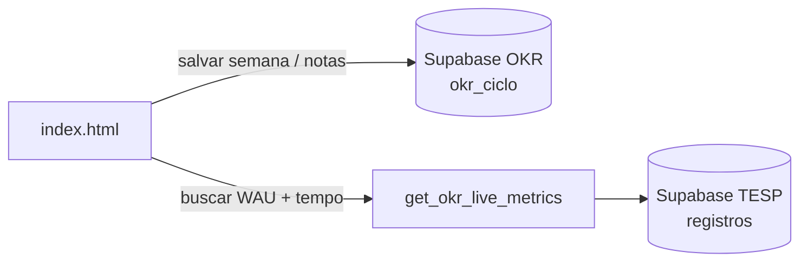

# Conectar o dashboard OKR ao banco TESP

O dashboard usa **dois projetos Supabase separados**:

| Projeto | Uso | Dados |
|---------|-----|-------|
| **1 ano em 12 semanas** | Registro semanal OKR (`okr_ciclo`) | Notas, receita manual, histórico por semana |
| **TESP \| Tempo de espera SP** | Métricas ao vivo | WAU e tempo médio de espera |

---

## Passo 1 — Credenciais do projeto TESP

1. Abra o [Supabase Dashboard](https://supabase.com/dashboard)
2. Selecione o projeto **TESP | Tempo de espera SP**
3. Vá em **Project Settings → API**
4. Copie:
   - **Project URL** (ex.: `https://xxxxxxxx.supabase.co`)
   - **anon public** key

---

## Passo 2 — Conferir a tabela `registros`

1. No projeto TESP, abra **Table Editor → registros**
2. Confirme que existem colunas equivalentes a:

| Coluna esperada | Uso |
|-----------------|-----|
| `user_id` | UUID do usuário autenticado (pode ser nulo) |
| `installation_id` | UUID da instalação anônima (pode ser nulo) |
| `tempo_espera` | Tempo de espera em **minutos** (numérico) |
| `created_at` | Data/hora do registro |

Se os nomes forem diferentes (ex.: `tempo_minutos`, `usuario_id`), edite o arquivo  
`supabase/tesp/get_okr_live_metrics.sql` antes de executar.

---

## Passo 3 — Criar a RPC no TESP

1. No projeto **TESP**, abra **SQL Editor**
2. Cole e execute o conteúdo de [`supabase/tesp/get_okr_live_metrics.sql`](../supabase/tesp/get_okr_live_metrics.sql)
3. Teste:

```sql
SELECT public.get_okr_live_metrics();
```

Resultado esperado:

```json
{"wau": 438, "tempo_medio": 5.6, "inicio": "...", "fim": "...", "updated_at": "..."}
```

### Definições das métricas

- **WAU** — quantidade de usuários distintos (`user_id` ou `installation_id`) que fizeram **ao menos 1 registro** na tabela `registros` durante o período
- **Tempo médio** — média aritmética de `tempo_espera` (minutos) de todos os registros no período

Por padrão o período são os **últimos 7 dias**. O dashboard também pode enviar datas customizadas.

---

## Passo 4 — (Opcional) Separar ciclos no projeto OKR

Se ainda não rodou, execute no projeto **1 ano em 12 semanas**:

[`supabase/okr/add_ciclo_column.sql`](../supabase/okr/add_ciclo_column.sql)

Isso evita que dados do Ciclo 2 apareçam no Ciclo 3.

---

## Passo 5 — Configurar o dashboard

Edite `index.html` e preencha as constantes do TESP:

```javascript
// Projeto OKR — 1 ano em 12 semanas
const OKR_SUPABASE_URL = 'https://sbywtjxgkhqdeplymhdz.supabase.co';
const OKR_SUPABASE_KEY = 'sua-chave-anon-do-projeto-okr';

// Projeto TESP — Tempo de espera SP
const TESP_SUPABASE_URL = 'https://SEU-PROJETO-TESP.supabase.co';
const TESP_SUPABASE_KEY = 'sua-chave-anon-do-projeto-tesp';
```

Salve, abra o dashboard no browser e verifique o indicador **"Dados ao vivo"** no header.

---

## Passo 6 — Permissões (se a RPC retornar erro)

Se `get_okr_live_metrics()` existir mas o dashboard não conseguir chamar:

1. Confirme que o `GRANT EXECUTE ... TO anon` foi executado (está no SQL acima)
2. Em **Authentication → Policies**, verifique se a RPC não está bloqueada

A RPC usa `SECURITY DEFINER`, então ela lê `registros` com permissão elevada — o cliente anon só precisa de permissão para **executar a função**, não para ler a tabela diretamente.

---

## Solução de problemas

| Sintoma | Causa provável | Ação |
|---------|----------------|------|
| "Sem conexão" no header | Chave anon errada ou URL incorreta | Revise Passo 1 e 5 |
| Sincronizado, mas sem "Dados ao vivo" | RPC não criada no TESP | Execute Passo 3 |
| RPC retorna erro de coluna | Nome de coluna diferente em `registros` | Ajuste o SQL e reexecute |
| WAU = 0 com dados na tabela | Colunas `user_id`/`installation_id` vazias | Confira schema real da tabela |
| Tempo médio = null | Coluna de tempo com outro nome ou sem dados no período | Ajuste `tempo_espera` no SQL |

---

## Arquitetura


