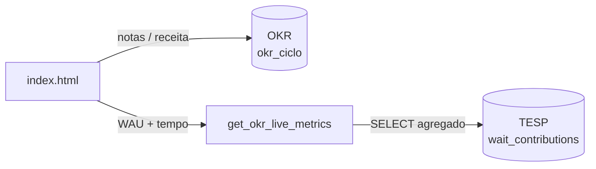

# Conectar o dashboard OKR ao banco TESP

O dashboard usa **dois projetos Supabase separados**:

| Projeto | Uso | Dados |
|---------|-----|-------|
| **1 ano em 12 semanas** | Registro semanal OKR (`okr_ciclo`) | Notas, receita manual, histórico por semana |
| **TESP \| Tempo de espera SP** | Métricas ao vivo | WAU e tempo médio via `wait_contributions` |

---

## Como funciona

Nenhuma tabela nova é criada. Uma **função RPC** (`get_okr_live_metrics`) lê a tabela existente `wait_contributions` e calcula:

| Métrica | Definição |
|---------|-----------|
| **WAU** | Contribuidores distintos (`contributor_user_id` ou `app_install_id`) com ≥1 registro no período |
| **Tempo médio** | Média de `wait_ms` convertida para minutos (`wait_ms / 60000`) |

Período padrão: **últimos 7 dias**.

---

## Setup (já aplicado no TESP)

A função já foi criada no projeto **TESP | Tempo de espera SP** via migration `get_okr_live_metrics`.

Para replicar manualmente, execute [`supabase/tesp/get_okr_live_metrics.sql`](../supabase/tesp/get_okr_live_metrics.sql) no SQL Editor do TESP.

Teste:

```sql
SELECT public.get_okr_live_metrics();
```

---

## Credenciais no dashboard

Em `index.html`:

```javascript
// OKR — 1 ano em 12 semanas
const OKR_SUPABASE_URL = 'https://sbywtjxgkhqdeplymhdz.supabase.co';
const OKR_SUPABASE_KEY = '...';

// TESP — Tempo de espera SP
const TESP_SUPABASE_URL = 'https://qrlsyhffqrprbljhirkk.supabase.co';
const TESP_SUPABASE_KEY = '...'; // anon key do projeto TESP
```

---

## (Opcional) Separar ciclos no projeto OKR

Execute no projeto **1 ano em 12 semanas**: [`supabase/okr/add_ciclo_column.sql`](../supabase/okr/add_ciclo_column.sql)

---

## Arquitetura



---

## Solução de problemas

| Sintoma | Ação |
|---------|------|
| Sem "Dados ao vivo (TESP)" | Confirme URL/key do TESP e se a RPC existe |
| WAU = 0 | Verifique se há registros recentes em `wait_contributions` |
| Tempo médio = null | Registros sem `wait_ms` no período |
